The *SimQuality* test suite checks for correct calculation of individual 
model aspects and combined effects.

The test suite is organized in test cases (german "TestFall" hence "TF" prefix of directories),
with usually several simulation projects.

The subdirectory `climate` contains climate data files in `c6b` format (created as 
described in the test suite).

## Validation Results

### TestCase 01

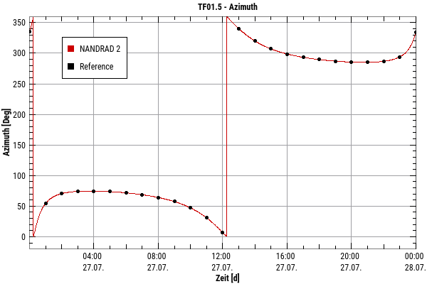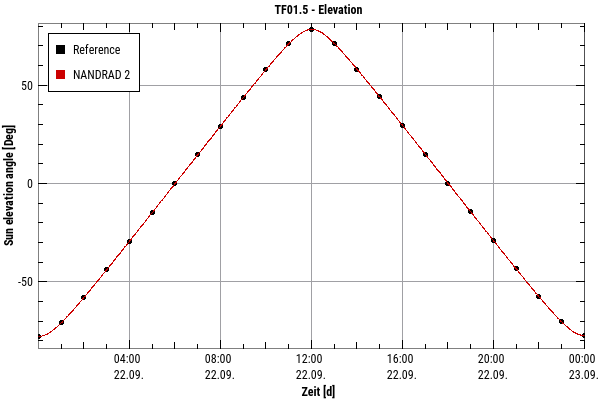

### TestCase 02

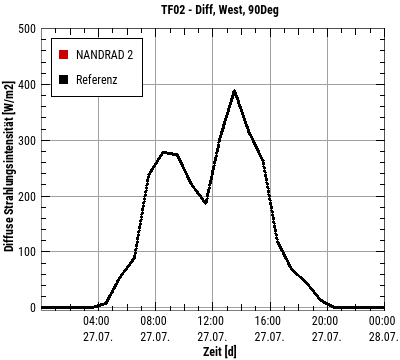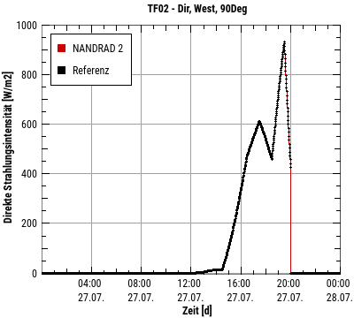

### TestCase 03

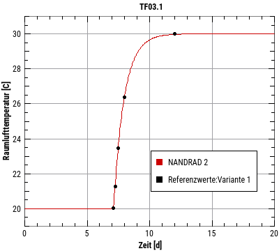 
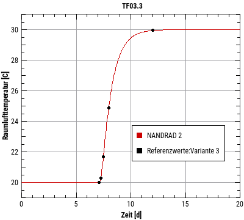

### TestCase 04

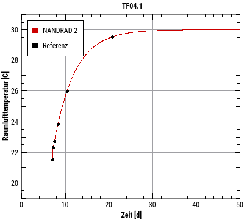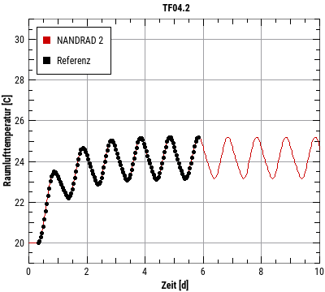 
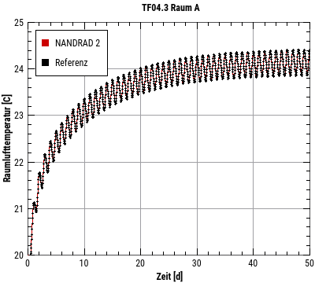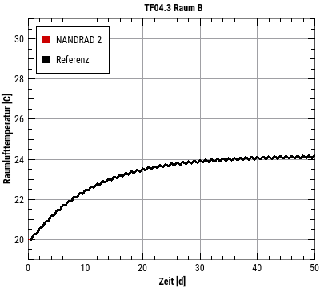 
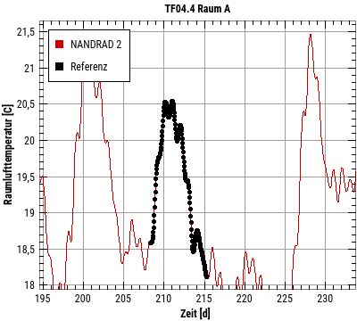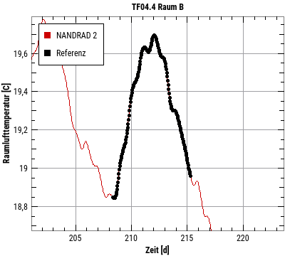

### TestCase 05

 

### TestCase 06

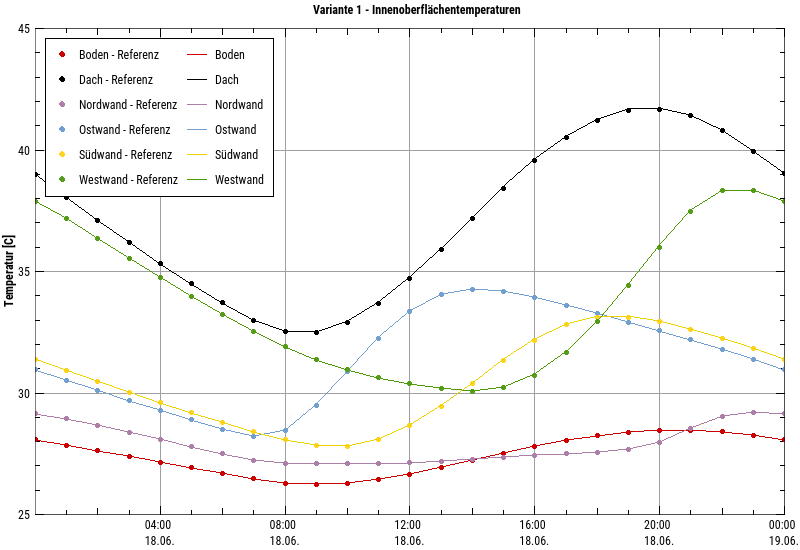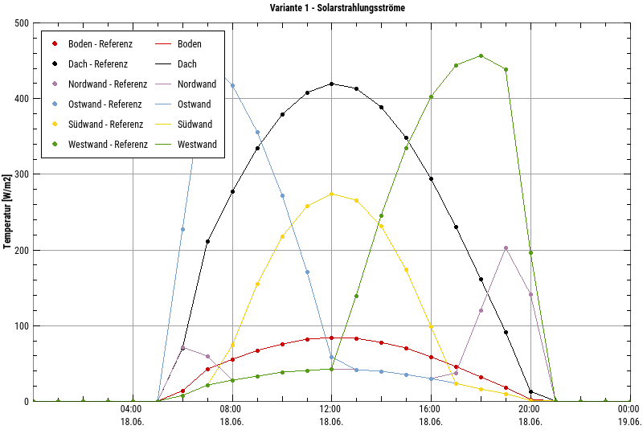
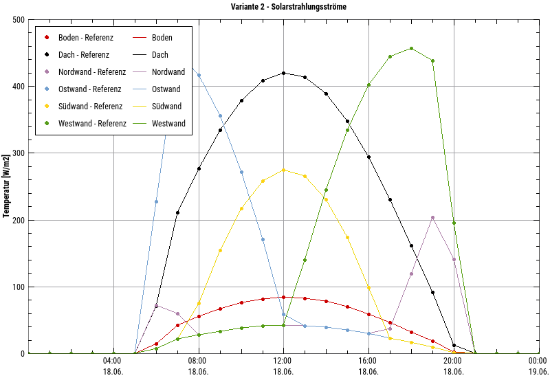

### TestCase 07

#### Variante 1

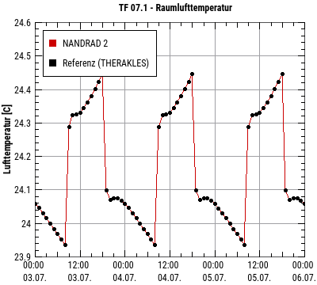 

#### Variante 2

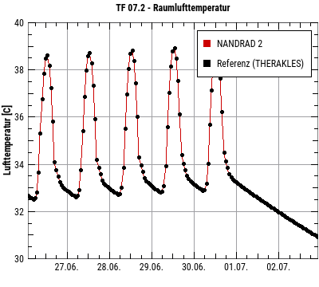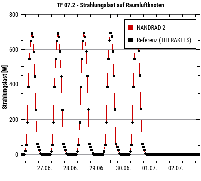 
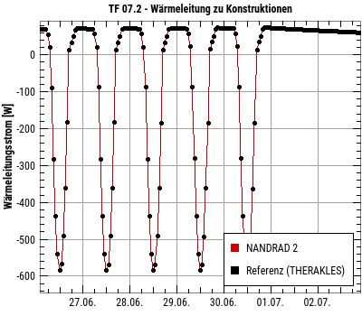
