# Kleine Einführung ins QwtPlot

Ein paar kleinere Beispiele sollen zunächst die grundlegende Funktionalität und Benutzung des `QwtPlot`-Widgets zeigen.

> **Hinweis:** In den nachfolgenden Beispielen werden die in der Qwt-Bibliothek enthaltenen Klassen direkt verwendet und nur deren Attribute angepasst. Weiterführende Anpassungen durch Re-Implementierung von Funktionen in abgeleiteten Klassen werden im Kapitel [Anpassungen](customization) beschrieben.

## Ein Kurvendiagramm

Beginnen wir mit einem einfachen X-Y-Diagramm welches eine Linie darstellt:

```c++
#include <QApplication>
#include <QwtPlot>         // oder <qwt_plot.h>
#include <QwtPlotCurve>    // oder <qwt_plot_curve.h>

int main( int argc, char **argv ) {
    QApplication a( argc, argv );

    // create plot as main widget
    QwtPlot plot;
    plot.setTitle( "Plot Demo" );
    plot.setCanvasBackground( Qt::white );

    // create a new curve to be shown in the plot and set some properties
    QwtPlotCurve *curve = new QwtPlotCurve();
    curve->setTitle( "Some Points" ); // will later be used in legend
    curve->setPen( Qt::blue, 4 ), // color and thickness in pixels
    curve->setRenderHint( QwtPlotItem::RenderAntialiased, true ); // use antialiasing

    // data points
    QPolygonF points;
    points << QPointF( 0.0, 4.4 ) << QPointF( 1.0, 3.0 )
        << QPointF( 2.0, 4.5 ) << QPointF( 3.0, 6.8 )
        << QPointF( 4.0, 7.9 ) << QPointF( 5.0, 7.1 );

    // give some points to the curve
    curve->setSamples( points );

    // set the curve in the plot
    curve->attach( &plot );

    plot.resize( 600, 400 );
    plot.show();

    return a.exec();
}
```
Dies ergibt ein (noch ziemlich langweiliges) Diagrammfenster:

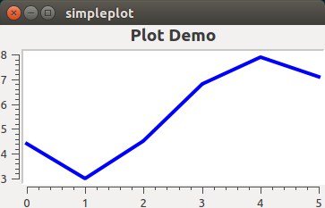

### Include-Dateien

Grundsätzlich gibt es zwei unterschiedliche Varianten für Include-Dateinamen - entweder man verwendet die tatsächlichen Header-Dateinamen, also z.B. `#include <qwt_plot.h>` für die Klasse `QwtPlot`, oder man verwendet die klassenspezifischen Headerdateien `#include <QwtPlot>` (das sind Verweise auf die eigentlichen Headerdateien, wie bei Qt5 üblich). Da manche Headerdateien die Deklarationen für verschiedene Qwt-Klassen enthalten, ist es häufig einfacher bei Kenntniss des Klassennames auch einfach die entsprechend gleichnamigen Headerdateien zu verwenden.

> **Hinweis:** In den nachfolgenden Beispielen werden die _neuen_ Headerdateinamen (=Klassennamen) verwendet. In den Beispielen im `examples`-Verzeichnis der Qwt-Bibliothek werden die eigentlichen Headerdateinamen eingebunden.

### Plot-Widget und Hintergrundfarbe der Zeichenfläche

Im obigen Quelltext wird zunächst das `QwtPlot` Widget erstellt und erhält einen Titel. Der  `CanvasBackground` ist der Hintergrund der Zeichenfläche. Der Befehl:
```c++
plot.setCanvasBackground( Qt::white );
```
legt nur die Hintergrundfarbe der eigentlichen Zeichenfläche (engl. _Canvas_) fest (siehe auch [Erscheinungsbild des Plots anpassen](#erscheinungsbild-des-plots-anpassen)).

### Kurve als Zeichenobjekt hinzufügen
Als nächstes wird ein Zeichenobjekt (engl. _PlotItem_) für eine Linie/Kurve erstellt und konfiguriert.

Es gibt viele verschiedene Arten von Zeichenobjekten. Alle haben gemeinsam, dass sie auf der Zeichenfläche gezeichnet werden. Die Reihenfolge des Zeichnens ist dabei für die Sichtbarkeit der einzelnen Zeichenobjekte wichtig (dazu später mehr, siehe Abschnitt [Zeichenreihenfolge](advanced/#zeichenreihenfolge)).

**Grundsätzlich** werden alle Zeichenobjekte **auf dem Heap (im Hauptspeicher) erstellt** und später dem Plot übereignet. Das passiert mit:
```c++
curve->attach( &plot );
```
wobei das Plot Besitzer des Zeichenobjekts (d.h. unserer Kurve) wird und sich später um das Speicheraufräumen kümmert.

Zu den sinnvoll anzupassenden Eigenschaften einer Kurve gehören die Farbe und die Linienstärke, siehe `QwtPlotCurve::setPen()`. Bei dicken Linien lohnt sich das Einschalten von Antialiasing für die Liniendarstellung.

> **Hinweis:** Das Setzen von Zeichenattributen via `setRenderHint()` wird von allen Zeichenobjekten unterstützt. So kann man Eigenschaften wie Antialiasing individuell für verschiedene Zeichenobjekte setzen.

Die hinzugefügte Kurve ist standardmäßig der unteren X-Achse und der linken Y-Achse zugeordnet, sodass die Daten der Kurve gleichzeitig zur automatischen Skalierung der Achsen verwendet werden.

Der Titel der Linie wird mittels `QwtPlotCurve::setTitle()` gesetzt und in der Legende verwendet, welche wir als nächstes einfügen (weitere Kurveneigenschaften werden später besprochen).

## Legende, Diagrammachsen und Hauptgitterlinien

### Legende hinzufügen

Um eine Legende hinzuzufügen, braucht man lediglich eine Instanz der `QwtLegend`-Klasse erstellen und im Plot einfügen:
```c++
QwtLegend * legend = new QwtLegend();
plot.insertLegend( legend , QwtPlot::BottomLegend);
```
Der dazugehöriger Header wird mittels `#include <QwtLegend>` eingebunden. Wie auch beim Zeichenobjekt (Kurve) wird das Plot Besitzer der Legende und verwaltet die Resource.

> **Hinweis:** Wird eine andere Legende gesetzt, so wird die alte zuerst gelöscht. Es ist daher nicht erlaubt, auf eine ersetzte Legende weiterhin zuzugreifen (um das zu umgehen, siehe auch [Besitzübernahme von Objekten des Plots](advanced/#besitzubernahme-von-objekten-des-plots)).

Weitere Eigenschaften der Legende werden im Kapitel zur [Legendenformatierung](#legenden) erläutert.

### Diagrammachsen konfigurieren

Im Gegensatz zu Legende oder Kurven sind Achsen keine Zeichenobjekte sondern fest mit dem Diagramm verbunden. Die Sichtbarkeit der 4 Achsen (links, rechts, oben und unten) kann jedoch individuell festgelegt werden.

Achseneigenschaften legt man direkt über Zugriffsfunktionen der `QwtPlot`-Klasse fest, wie z.B. selbstgewählte min/max-Werte:
```c++
plot.setAxisScale( QwtPlot::yLeft, 0.0, 10.0 );
```
Die Achsen werden durch `QwtPlot::yLeft`, `QwtPlot::yRight`, `QwtPlot::xBottom` und `QwtPlot::xTop` identifiziert.

### Gitterraster einfügen

Um in der Zeichenfläche Gitterlinien zu zeichnen, fügt man einfach ein entsprechendes Zeichenobjekt hinzu.
```c++
QwtPlotGrid *grid = new QwtPlotGrid();
grid->setMajorPen(QPen(Qt::DotLine));
grid->attach( &plot );
```
Wie schon bei der Legende wird die Instanz der Klasse `QwtPlotGrid` (einzubinden via `#include <QwtPlotGrid>`) zunächst im Hauptspeicher angelegt, konfiguriert (hier wird nur der QPen der Hauptgitterlinien verändert) und schließlich dem Plot hinzugefügt.

### Liniensymbole hinzufügen

Als ein Beispiel etwas weiterführender Konfiguration der Linien (`QwtPlotCurve`) wird hier ein Liniensymbol hinzugefügt. Diese Eigenschaft (konkret das Zeichnen des Symbols) ist wieder anpassungsfähig ausgelegt und nicht fest in der Klasse `QwtPlotCurve` integriert.

Für das Zeichnen von Symbolen existiert die Klasse `QwtSymbol`, welche nicht direkt als Zeichenobjekt verwendet wird, sondern eine Hilfsimplementierung für verschiedene Anwendungszwecke darstellt. Liniensymbole werden folgendermaßen erstellt:
```c++
QwtSymbol *symbol = new QwtSymbol(
    QwtSymbol::Ellipse,    // Form
    QBrush( Qt::yellow ),  // Füllung
    QPen( Qt::red, 2 ),    // Rand
    QSize( 8, 8 ) );       // Größe in Pixel

curve->setSymbol( symbol ); // Kurve wurde Besitzer
```

Mit diesen Anpassungen sieht das Diagramm schon besser aus (siehe auch Beispiel `examples/SimplePlot`)

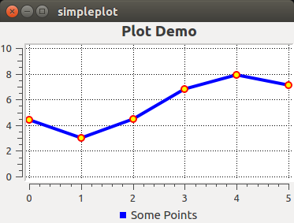

----

# Diagrammtypen

- allgemeines zu PlotItems/Curves


## Liniendiagramme und Punktwolken

Liniendiagramme, Punktwolken oder sonstige X-Y-Datenreihen werden mittels `QwtPlotCurve` Diagrammtypen gezeichnet. Wie im Beispiel oben wird eine Instanz einer solchen PlotCurve erstellt und dem Diagramm angehangen. Die Attribute einer `QwtPlotCurve` sind vielfältigt:

- `CurveStyle` - legt fest, wie die Datenpunkte gezeichnet werden sollen
- `CurveAttribute`- Zeichenattribute
- `LegendAttribute` - beinflusst die Darstellung der Legendensymbole
- `PaintAttribute` - Performance-bezogene Darstellungsoptionen

Symbole (Marker) werden via `QwtPlotCurve::setSymbol()` hinzugefügt.

### Entfernen von Kurven
Kurven können Diagrammen entnommen oder nur ausgeblendet werden:

1. mittels `curve->detach()` wird die Kurve dem Diagramm **und** der Legende entnommen (der Speicher der Kurve wird _nicht_ freigegeben!),
2. unsichtbar schalten mittels `curve->setVisible(false)`, oder
3. alternativ Linientyp auf NoCurve und Symbol entfernen:
```c++
curve->setStyle(QwtPlotCurve::NoCurve);
curve->setSymbol(NULL);
```
Bei Variante (2) und (3) bleibt der Legendeneintrag aber bestehen. Da kann man dann aber immer noch den Legendeneintrag ausblenden:
```c++
// das LegendenWidget, d.h. Legendeneintrag von der Legende holen
QWidget* legendWidget = d_legend->legendWidget(itemToInfo(plotCurve));
// Standardmäßig ist das Widget des Legendeneintrags vom Typ QwtLegendLabel
QwtLegendLabel* label = qobject_cast<QwtLegendLabel*>(legendWidget);
label->setVisible(true);
```

### Feststellen, ob eine Kurve hinzugefügt ist
`QwtPlotCurve::plot()` liefert einen Zeiger auf das Diagramm, dem die Kurve hinzugefügt wurde, oder `NULL`, wenn die Kurven derzeit keinem Plot zugeordnet ist.

----

## Balkendiagramme
Balkendiagramme zeigen Datenreihen als Balken, entweder horizontal oder vertikal. Dabei können die Balken groupiert oder aufeinandergestapelt angezeigt werden:

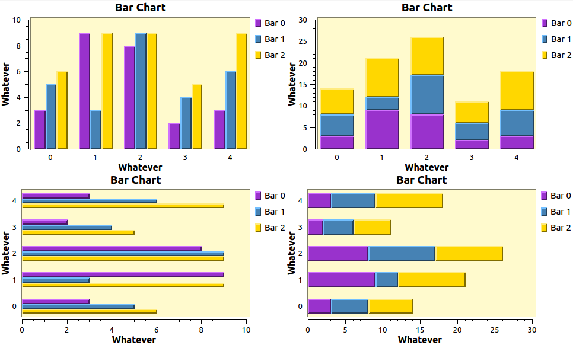

Das Beispiel `barchart` demonstriert die Erstellung:
```c++
// zuerst ein PlotItem für Balkendiagramme erstellen
QwtPlotMultiBarChart * d_barChartItem = new QwtPlotMultiBarChart( "Bar Chart " );
// die Breite der Balken soll automatische anhand der Achsenskalierung
// und Widgetbreite bestimmt werden
d_barChartItem->setLayoutPolicy( QwtPlotMultiBarChart::AutoAdjustSamples );
// man kann die Abstände zwischen den Balken konfigurieren
d_barChartItem->setSpacing( 20 );
d_barChartItem->setMargin( 3 );
// und wie immer wir zuletzt das PlotItem dem Diagramm hinzugefügt
d_barChartItem->attach( this );
```

Eine Legende wird genau wie bei anderen Diagrammtypen hinzugefügt (siehe auch [Legenden](#legenden)). Es ist eventuell sinnvoll, die Legendenicongröße anzupassen. Da die Legendenicons vom jeweiligen Diagrammelement generiert werden (hier vom QwtPlotMultiBarChart), setzt man die Legendenicongröße auch darüber:
```c++
d_barChartItem->setLegendIconSize( QSize( 10, 14 ) );
```
Die Daten eines Balkendiagramms sind in Datenpunkte (engl. _samples_) und Balken (engl. _bars_) organisiert.  Jeder Datenpunkt entspricht einem X-Achsenwert (bei vertikalen Balkendiagrammen) und für jeden Datenpunkt werden entsprechend viele Balken (nebeneinander/übereinander) gezeichnet.

Die Beschriftung auf der X-Achse (bzw. auf der Y-Achse bei horizontalen Balken) wird mit `QwtPlotMultiBarChart::setTitles()` gesetzt:
```c++
QList<QwtText> titles;
titles << "First group";
titles << "Second group";
titles << "Third group";
d_barChartItem->setBarTitles( titles );
```
Das Erscheinungsbild der Balken definiert man durch Erstellen und Setzen von `QwtColumnSymbol` Objekten:

```c++
// Balkenfarben definieren
static const char *colors[] = { "DarkOrchid", "SteelBlue", "Gold" };
const int numBars = 3;
// Für jeden Balken ein Symbol definieren
for ( int i = 0; i < numBars; i++ )
{
    QwtColumnSymbol *symbol = new QwtColumnSymbol( QwtColumnSymbol::Box );
    // Die Konfiguration ist ähnlich der regulärer Widgets
    symbol->setLineWidth( 2 ); // Pixel-Dimension
    symbol->setFrameStyle( QwtColumnSymbol::Raised );
    symbol->setPalette( QPalette( colors[i] ) );

    d_barChartItem->setSymbol( i, symbol );
}
```
Die eigentlich Daten werden in einer Matrix definiert, welche zum Beispiel in einem Container `QVector< QVector<double> >` abgelegt werden können. Der erste Index ist die Nummer des "Samples" (der Gruppe), der zweite Index entspricht dem Balkenindex der jeweiligen Gruppe:
```c++
int numSamples = 5; // 5 Gruppen
QVector< QVector<double> > samples;
for ( int i = 0; i < numSamples; i++ ) {
    QVector<double> values(numBars);
    // setzen der Werte
    values[0] = barValue1;
    values[1] = barValue2;
    values[2] = barValue3;
    // ...

    // hinzufügen zur samples-Matrix
    samples.append(values);
}

// Abschließend werden dem BarPlot die Daten übergeben
d_barChartItem->setSamples( samples );
```

Ein derart erstelltes BarChart sieht zunächst so aus:
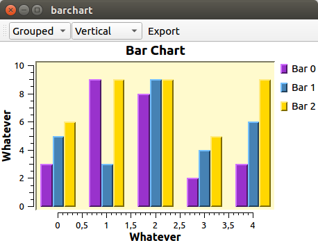

Die Samples sind standardmäßig ganzzahligen X-Koordinaten (0,1,2...) zugeordnet.

Die Achsen werden ganz genauso wie bei anderen Diagrammtypen angepasst (siehe [Achsen](#achsen)). Üblicherweise werden bei Balkendiagrammen jedoch keine Ticks und Ticklabels angezeigt. Daher kann man diese ausstellen:
```c++
// Zugriff auf das Zeichenobjekt für die Achsen holen
QwtScaleDraw *scaleDraw1 = plot->axisScaleDraw( QwtPlot::xBottom );
// Die Achsenlinie und die Ticks lassen sich individuell abschalten
scaleDraw1->enableComponent( QwtScaleDraw::Backbone, false );
scaleDraw1->enableComponent( QwtScaleDraw::Ticks, false );
```
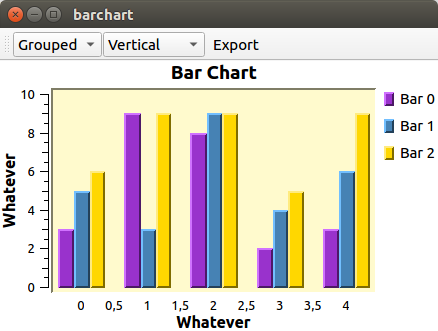

Die Balken jeder Gruppe werden zentriert um die zugeordnete Koordinate gezeichnet, wodurch effektiv eine Skale verwendet wird, die in den negativen Bereich geht. Wird die Zeichenfläche auf die Koordinatenachse ausgerichtet, so werden die Balken am linken und rechten Rand abgeschnitten. Für vertikale Balken lässt sich das über die folgenden Befehle ausschalten:
```c++
// linksseitig nicht bei 0 abschneiden
plotLayout()->setAlignCanvasToScale( QwtPlot::yLeft, false );
// rechtsseitig nicht beim Maximalwert der X-Achse aufhören
plotLayout()->setAlignCanvasToScale( QwtPlot::yRight, false );
```

### Spezielle Beschriftungen
Manchmal möchte man die Balkengruppe besonders beschriften, wie in folgendem Beispiel:
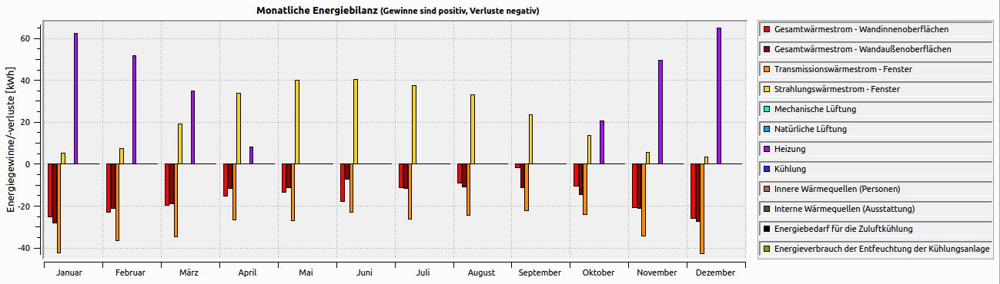

Dieses ist mit Qwt 6.1.x und den eingebauten Eigenschaften so nicht möglich. Kapitel [Balkendiagramme mit Kategoriebeschriftungen](/customization#balkendiagramme-mit-kategoriebeschriftungen) beschreibt die Vorgehensweise, um mit eigens angepassten Klassen, diese Diagramme zu erstellen.

### Balken entfernen und wieder hinzufügen
Balken können mittels `QwtPlotMultiBarChart::setVisible()` sichtbar oder unsichtbar geschaltet werden. Dabei bleibt jedoch der entsprechende Legendeneintrag in der Liste. Möchte man den Balken einschließlich Legendenicon entfernen, so muss man das Balkendiagramm neu konfigurieren, d.h. neue Titel und neue Daten (mit passender Dimension des Samples-Matrix) setzen.

> _TODO:_ eleganter Weg einzelne Balken auszublenden?

## Spektrogramme

- erste Anwendung der Re-Implementierungstechnik
- value() Berechnung
- spezielle Optimierungen

## Vektorfelder
ab `6.3.x_trunk`

- Eingangsdaten, Interpretation
- Konfiguration

# Erscheinungsbild des Plots anpassen

## Rahmen und Zeichenfläche

Beim QwtPlot können verschiedene Elemente angepasst werden. Nachfolgend ist ein QwtPlot zu sehen, welches in einem äußeren Widget (dunkelgray) eingebettet ist. Die hellgraue Fläche ist das eigentliche `QwtPlot`:

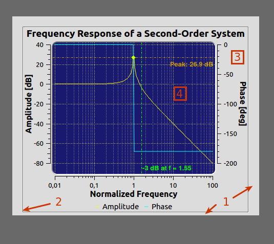

Im Screenshot sind die wichtigsten Attribute markiert:

1. Innenabstand (siehe `QWidget::setContentsMargins()`)
2. Rahmen (hauptsächlich für den Druck wichtig)
3. Hintergrund des Plot-Widgets
4. Zeichenfläche (engl. _Canvas_) (betrifft Hintergrundfarbe und Rahmen)

### Farbe und Rahmen des Plots

Die Farbe des äußeren Bereichs des Plots wird über die Paletteneigenschaft des `QwtPlot` kontrolliert. Standardmäßig wird der äußere Rand des Plot-Widgets transparant gezeichnet, d.h. die Farbe des darunterliegenden Widgets ist sichtbar. Um eine eigene Farbe zu setzen, muss daher ```setAutoFillBackground(true)``` aufgerufen werden:
```c++
QPalette pal = plot.palette();
// Die QPalette::Window Farbrolle definiert die Einfärbung
// des äußeren Plotbereichs
pal.setColor(QPalette::Window, QColor(196,196,220));
plot->setPalette(pal);
// die Eigenschaft "autoFillBackground" muss dafür eingeschaltet sein
plot->setAutoFillBackground(true);
```
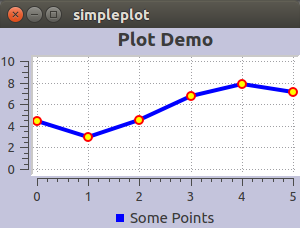

> **Hinweis:** In Abschnitt [Gradient als Plot-Hintergrund](customization/#gradient-als-plot-hintergrund) wird beschrieben, wie man einen Farbverlauf im Plothintergrund umsetzt, und diesen bei Größenänderung entsprechend anpasst.

Der Rahmen wird wie bei einem normalen Widget angepasst:
```c++
plot->setFrameStyle(QFrame::Box | QFrame::Sunken);
```
Normalerweise ist ein solcher Rahmen nicht notwendig für die Bildschirmdarstellung oder für das Einbetten des QwtPlot in eine Programmoberfläche. Der Rahmen ist jedoch häufig beim [Export/Druck](export) des Widgets sinnvoll.

### Zeichenfläche

Die Zeichenfläche kann eingefärbt werden:
```c++
plot->setCanvasBackground(Qt::darkGray);
```
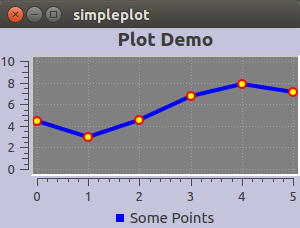

Der Randabstand zwischen Achsenbeschriftung und Titel zum Rand kann definiert werden:
```c++
plot->setContentsMargins(15,10,35,5);
```
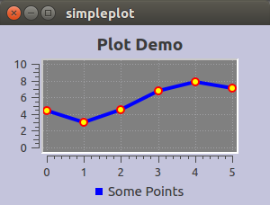

Die Rahmen um die Zeichenfläche kann durch Anpassen des Zeichenflächenobjekts (`QwtPlotCanvas`) verändert werden. `QwtPlotCanvas` ist von QFrame abgeleitet, wodurch es entsprechend angepasst werden kann. Es wird einfach neues Objekt erstellt, konfiguriert und dem Plot übergeben (das QwtPlot wird neuer Besitzer des Zeichenflächenobjekts):
```c++
QwtPlotCanvas * canvas = new QwtPlotCanvas(&plot);
canvas->setPalette(Qt::white);
canvas->setFrameStyle(QFrame::Box | QFrame::Plain );
canvas->setLineWidth(1);
plot->setCanvas(canvas);
```
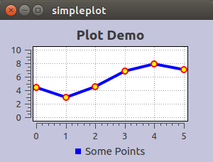

Einfacher geht es durch Setzen des Stylesheets für das Canvas-Widget (siehe Qt-Widgets Dokumentation, welche Attribute unterstützt werden):
```c++
plot->canvas()->setStyleSheet(
    "border: 1px solid Black;"
    "border-radius: 15px;"
    "background-color: qlineargradient( x1: 0, y1: 0, x2: 0, y2: 1,"
        "stop: 0 LemonChiffon, stop: 1 PaleGoldenrod );"
);
```
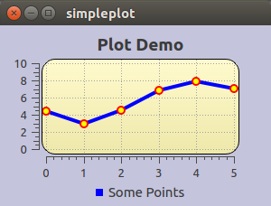

### Erweiterte Anpassungen

Wie das Layout der Achsen, Legende, Titel, Kopf- und Fußzeile und die jeweiligen Abstände zusätzlich angepasst werden können, ist in Kapitel [Das Layout-System](customization/#das-layout-system) beschrieben.

# Diagrammelemente

## Titel, Kopf- und Fußzeile

- wo sind die
- RichText-Unterstützung (HTML Tags)

## Kurven

- Attribute von Kurven
- Erscheinungsbild und Wirkung von RenderHints
- Zeichenreihenfolge (anpassen)

## Legenden

Grundsätzlich kann ein `QwtPlot` zwei Legenden haben, und diese sogar gleichzeitig:

- eine außenliegende Legende, und/oder
- eine Legende innerhalb der Zeichenfläche (über oder unter den anderen Diagrammelementen)

Die Einträge der Legenden werden von den jeweiligen Diagrammtypen (Linen-, Balken-, Farbverlaufsdiagramme) beigesteuert und auch von diesen gezeichnet. Die Legende verwaltet nur deren Positionierung innerhalb der Legende.

### Außenliegende Legenden
Eine außenliegende Legende bedeutet, dass ein reguläres Widget die Legende hält und seitlich (oben, unten, links oder rechts) der Zeichenfläche angeordnet ist.

Dieses Widget kann auch abseits des QwtPlot in einem anderen Teil des Layouts angeordnet werden. In diesem Fall spricht man von einer _externen Legende_.

Dazu wird eine Instanz der Klasse `QwtLegend` erstellt und dem Diagramm hinzugefügt:
```c++
QwtLegend * d_legend = new QwtLegend;
insertLegend(d_legend, QwtPlot::RightLegend);
```
Dabei ist `QwtLegend` ein ganz reguläres Widget. Intern enthalten Sie ein dynamisches Rasterlayout (Klasse `QwtDynGridLayout`), welches die Legendeneinträge je nach verfügbarem Platz mehrspaltig auslegt.

#### Maximale Anzahl der Spalten in der Legende
Die Anzahl der maximal zu verwendenden Spalten wird mittels `QwtLegend::setMaxColumns( uint numColums )` festgelegt. Ein Wert von 0 (Standard) definert keine Begrenzung. Das ist für Legenden unterhalb und oberhalb des Plots sinnvoll, da hier auch mitunter sehr viele Legendeneinträge nebeneinander gezeichnet werden sollen. Links- und rechtsseitig angeordnete Legenden haben aber üblicherweise nur eine Spalte:
```c++
// links und rechtsseitige Legenden sollen nur eine Spalte verwenden
d_legend->setMaxColumns(1);
```
#### Positionierung der Legende
Die Positionierung der Legende wird beim Einfügen der Legende festgelegt. `QwtPlot::insertLegend()` erwartet einen der vier möglichen Parameter: `QwtPlot::BottomLegend`, `QwtPlot::TopLegend`, `QwtPlot::RightLegend`, `QwtPlot::LeftLegend`. Wird die Funktion `insertLegend()` ein weiteres Mal aufgerufen, so wird zunächst die alte Legende gelöscht (auch der Speicher wird freigegeben) und dann wird die neue Legende eingefügt.

#### Legende entfernen
Ruft man `QwtPlot::insertLegend()` mit einem NULL-Zeiger auf, so wird die bisherige Legende gelöscht, aber keine neue eingefügt. Damit entfernt das Plot auch das Legendenwidget.

> **Hinweis**: Der Abschnitt [Besitzübernahme von Objekten des Plots](advanced/#besitzubernahme-von-objekten-des-plots) zeigt einen Trick, wie man z.B. eine Legende dem Plot temporär entnehmen kann und später wieder hinzufügen kann, ohne dass das Legendenobjekt neu im Speicher erstellt werden muss.

#### Abstände zwischen Legendeneinträgen
Bei einer außenliegende Legende sind die eigentlichen Legendeneinträge selbst Widgets die in einem dynamischen GridLayout angeordnet sind. Das dynamische GridLayout steckt selbst in einer QScrollArea-Widget, weswegen die Legende bei zu wenig Platz mit Scrollbalken ausgestattet wird. Auf dieses QScrollArea-Widget kann man mittels `QwtLegend::contentsWidget()` zugreifen, und darüber auf das dynamische GridLayout.

Wie bei anderen QLayout-Klassen lassen sich die Abstände zwischen den Widgets mit `QLayout::setSpacing()` anpassen. Interessant ist das vor allem bei [umschaltbaren/anklickbaren Legendeneinträgen](interaction/#legendeneintrage-einausschalten):

```c++
// verkleinern der Abstände zwischen den Legendeneinträgen
d_legend->contentsWidget()->layout()->setSpacing(1);
```

So lassen sich auch Legenden mit vielen Einträgen recht kompakt anzeigen:

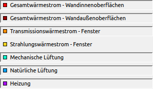 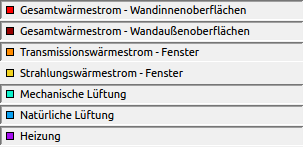

#### Rahmen und farbiger Hintergrund bei der Legende
Da QwtLegend-Objekte selber Widgets sind, lässt sich das Erscheinungsbild entsprechend mit Qt-Standardmitteln anpassen, z.B. ein Rahmen setzen und die Hintergrundfarbe anpassen:
```c++
// einfacher Rahmen
d_legend->setFrameStyle(QFrame::Box|QFrame::Sunken);
// Hintergrundfarbe anpassen
QPalette pal = d_legend->palette();
pal.setColor(QPalette::Window, backgroundColor);
d_legend->setPalette(pal);
// Wichtig: Widget soll selbst den Hintergrund zeichnen
d_legend->setAutoFillBackground(true);
```
Gegenüber der Standardeinstellung (links) hebt sich die Legende dadurch optisch ab (rechts):

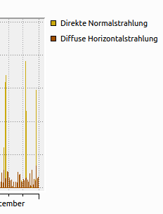 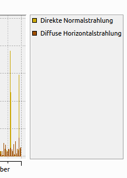

#### TODO

- Ratio Parameter

### Legendensymbole
Die LegendIcons bzw. allgemein die Einträge in der Legende werden vom jeweiligen PlotItem bzw. der Kurve generiert. Entsprechende Anpassungsfunktionen sind daher für die jeweiligen Diagrammtypklassen verfügbar, d.h. in `QwtPlotCurve`, `QwtPlotSpectrogram` und `QwtPlotMultiBarChart` definiert.

Man kann die Legendeneinträge auch komplett selbst zeichnen, wie im Kapitel [Eigene Legendeneinträge zeichnen](customization/#eigene-legendeneintrage-zeichnen) beschrieben ist.

#### Darstellung der Legendeneinträge bei Kurven: Linie, Rechteck oder Farbe?
...`QwtPlotCurve::setLegendAttribute()`


### Innenliegende Legenden
- Skizze mit relevanten Abmessungen
- Konfiguration
- Offset (Version 6.1.x und 6.3.x_trunk)


## Achsen

- allgemeines zum Zusammenspiel zwischen ScaleDiv und ScaleDraw, wie werden diese von Achsen verwendet
- woher erhalten Achsen die Werte

### Sichtbarkeit der Achsen

Achsen können individuell sichtbar oder versteckt geschaltet werden. Standardmäßig sind die xBottom-Achse und die yLeft-Achse sichtbar. Die Sichtbarkeit wird mit `QwtPlot::enableAxis(axisID, on)` umgeschaltet.

### Achsentitel

Achsentitel werden mittels `QwtPlot::setAxisTitle(int axisId, const QwtText &title)` gesetzt.

#### Achsentitel invertieren/von rechts lesbar machen
Bei technischen Diagrammen ist es üblich, den Titel der rechten y-Achse von rechts lesbar zu zeichnen. Dies wird durch Setzen eines LayoutFlags des Achsenwidgets erreicht:
```c++
plot->axisWidget(QwtPlot::yRight)->setLayoutFlag(QwtScaleWidget::TitleInverted, false);
```

### Achsenbeschriftung (Zahlen/Datum/Zeit)

Die Achsentitel können ferner rotiert und positioniert werden, wofür die Funktionen
```c++
void setAxisLabelAlignment( int axisId, Qt::Alignment );
void setAxisLabelRotation( int axisId, double rotation );
```
verwendet werden. Der Rotationswinkel wird hierbei in Grad angegeben. Je nach Rotation muss man den Abstand zwischen Label und Achse anpassen, bzw. die Ausrichtung (Alignment) verändern.

Für die untere X-Achse sind folgende Einstellungen sinnvoll:
```c++
// Senkrechte Beschriftung, von rechts lesbar
plot->setAxisLabelRotation(QwtPlot::xBottom, -90);
plot->setAxisLabelAlignment(QwtPlot::xBottom, Qt::AlignLeft | Qt::AlignVCenter);
// 45° Beschriftung
plot->setAxisLabelRotation(QwtPlot::xBottom, -45);
plot->setAxisLabelAlignment(QwtPlot::xBottom, Qt::AlignLeft | Qt::AlignBottom);
```

### Lineare Achsen und deren Eigenschaften
...

### Logarithmische Achsen und andere Transformationen
...
Beispiel: `scaleengine`

### Datums-/Zeit-Achsen

- Werte in ms (Epoche)
- Formatierung, Zoomstufen

----
## Bereichsmarkierungen

Ein horizontales oder vertikales Band als Hervorherbung kann durch ein `QwtPlotZoneItem` erstellt werden:
```c++
QwtPlotZoneItem* zone = new QwtPlotZoneItem();
zone->setPen( Qt::darkGray );
zone->setBrush( QColor( "#834358" ) );
// Ausrichtung: vertikales oder horizontales Band
zone->setOrientation( Qt::Horizontal );
// Der Bereich des Bandes in Koordinateneinheiten
zone->setInterval( 3.8, 5.7 );
// Hinzufügen zum Diagramm
zone->attach( this );
```

----
# Zeichenreihenfolge

Alle Elemente, die innerhalb der Zeichenflächte gezeichnet werden, sind von QwtPlotItem abgeleitet. Diese Klasse hat die Eigenschaft zValue, welche die Zeichenreihenfolge definiert. Höhere Werte bedeuten

- wie kontrolliert man die Zeichenreihenfolge (zValues)
- Standardreihenfolge beim Zeichnen

----
# Basisdatentypen

Die Qwt-Bibliothek bringt einige grundlegende Datentypen/Klassen mit, welche die Datentypen der Qt Bibliothek erweitert.

## QwtText

Die Klasse `QwtText` ersetzt die `QString` Klasse und erlaubt die Definition von Texten, welche auf unterschiedliche Art und Weise interpretiert und damit gezeichnet werden können.

Man kann mittels der `QwtText` Klasse unter anderem HTML-basierten RichText verwenden, z.B. für die Hoch- und Tiefstellung von Zahlen bei Einheiten:
```c++
// Ein Achsentitel mit HTML-basierter Hochstellung
QwtText axisTitle(tr("Area [m<sup>2</sup>]"), QwtText::RichText);
```
Natürlich können auf diese Weise auch beliebig in HTML formatierte Texte verwendet werden.

`QwtText` wird bei allen Zugriffsfunktionen verwendet, bei dehnen eine Zeichenkette verlangt wird.

### TextEngine

### PaintAttributes and LayoutAttributes


## Datenhalteklassen

### QwtRasterData

### QwtIntervalSample

### QwtSetSample

### QwtOHLCSample

### QwtVectorSample (ab Qwt 6.3.x)
