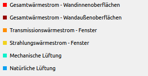
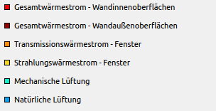

# Anpassung des QwtPlots durch Überladung

- Grundkonzepte: Überladung, Funktionalität anpassen durch Polymorphismus

## Überblick über die API

- Wo finde ich was; welche Klasse ist wofür zuständig (Liste)

## Das Layout-System
- Wie wird die konkrete Geometrie berechnet (Achsenlabels, Randabstände, Ticks, ...)

### Anpassung der Bildaufteilung

`QwtPlotLayout`

- Zeichenfläche hat Abstände zum Rand:
  + wenn `setAlignCanvasToScale()` false ist
  + Abstand entspricht: maximum aus canvasMargins (siehe setCanvasMargin) und borderDistHint des SkaleWidgets -> damit Label noch hinpasst

`setAlignCanvasToScale()`

# Achsen

- eigene ScaleDivs und ScaleDraws

## Balkendiagramme mit Kategoriebeschriftungen
...

## Proportionalität
- Proportionalität zweier Achsen einfordern


# Legenden

--> Aktualisierung der Legende nach Änderungen: `QwtPlotCurve::itemChanged()`

## Äußere Legenden
- Platzierung, Spalteanzahl, Abstände, ...
- Kontrolle über Sortierung der Einträge

## Innere Legenden
- Formatierung
- Reagieren auf Klicks
- Verschieben der Legende implementieren

## Eigene Legendeneinträge zeichnen


### Linendiagramme (QwtPlotCurve)
Wenn die eingebauten Legendenicon-Typen (Linie oder gefülltes Rechteck) nicht ausreichend sind, dann kann man einfach die Funktion `QwtPlotCurve::legendItem()` re-implementieren.

Beispiel: Die Legende soll Linien mittels gefüllter Rechtecke zeigen, aber umrandet mit einem schwarzen Rahmen




(links original, rechts mit angepasster Zeichenroutine)

Quelltext:
```c++
// Ableiten der QwtPlotCurve Klasse (z.B. direkt in der cpp-Datei,
// wo die Instanzen der QwtPlotCurve erstellt werden)
class PlotCurveWithBlackFrameInLegend : public QwtPlotCurve {
public:
  PlotCurveWithBlackFrameInLegend(const QString & desc) :
    QwtPlotCurve(desc)
  {}

  // Re-implementierung der legendIcon()-Funktion
  QwtGraphic legendIcon( int index, const QSizeF & size) const {
    Q_UNUSED( index );

    if ( size.isEmpty() )
      return QwtGraphic();

    QwtGraphic graphic;
    graphic.setDefaultSize( size );
    graphic.setRenderHint( QwtGraphic::RenderPensUnscaled, true );

    QPainter painter( &graphic );
    painter.setRenderHint( QPainter::Antialiasing,
    testRenderHint( QwtPlotItem::RenderAntialiased ) );
    QRectF r( 0, 0, size.width(), size.height() );

    // zeichne gefülltes Rechteck
    painter.setPen(Qt::black);
    painter.setBrush(pen().color());
    painter.drawRect( r);
    return graphic;
  }
};
```
Statt `QwtPlotCurve` Objekten kann man nun einfach Instanzen von `PlotCurveWithBlackFrameInLegend` erstellen und dem `QwtPlot` übergeben.


# Picker/zoomer
- Pickertext anpassen
- Zoomrect anders zeichnen (Beispiel: "marching ants")

# Balkendiagramme anpassen

## Balken mit schwarzen Trennlinien zeichnen
Erster Versuch:
```c++
QwtColumnSymbol* symbol = new QwtColumnSymbol(QwtColumnSymbol::Box);
symbol->setFrameStyle(QwtColumnSymbol::Plain);
symbol->setLineWidth(1);
QPalette palette;
palette.setColor(QPalette::Window, barColor); // barColor ist die Füllfarbe
palette.setBrush(QPalette::Dark, Qt::black);
symbol->setPalette(palette);
```

Aber: doppelte schwarze Linien sehen unelegant aus.

Neue Variante: `QwtPlotMultiBarChart::specialSymbol()`
Für stacked bars - links und rechts eine Linie und nur oben eine Linie.

In der Legende was anderes?


# Plot Darstellung

## Gradient als Plot-Hintergrund

Beispiel: SinusPlot
